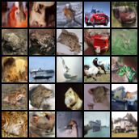
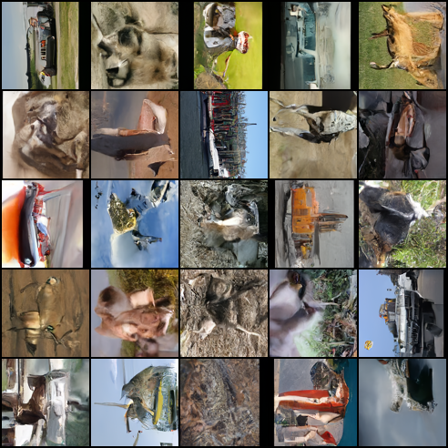

## Denoising Diffusion Probabilistic Model, in Pytorch

Adapted by `LHH90538`

配置要求：
系统：`Linux` (本项目可在AutoDL上实现)

python = 3.7 及以上

GPU：建议 `NVIDIA RTX 4090` 及以上


案例数据集
- `NMIST`手写数字 (28*28)， 微型
- `CIFAR-10` (48*48)， 小型数据集
- `STL-10` (96*96)， 中型数据集

## 1. 克隆和安装python库

```bash
git clone https://github.com/LHH90538/diffusion-demo.git
pip install denoising_diffusion_pytorch
```

## 2. CIFAR-10数据集训练

### 下载数据集并解压
```bash
cd diffusion-demo/CIFAR
```
用wget命令下载比较慢，建议手动在这个网址上(https://www.cs.toronto.edu/~kriz/cifar.html)
下载163MB的`( python版本!!! )`CIFAR-10数据集，然后上传到`diffusion-demo/CIFAR`文件夹中,然后解压：

```bash
tar -xzvf cifar-10-python.tar.gz
```
### 数据集文件转成png图片(约10万张)
```bash
python cifar2png.py
```

### 设置参数，开始训练

你可以打开`diffusion-demo/CIFAR/cifar_train.py`这个训练文件查看(或修改)参数，这个默认参数在RTX4090上需要训练3小时。如果你想快一些，可适当减少训练步数或U-net模型大小，不过生图效果也会下降

```python
from denoising_diffusion_pytorch import Unet, GaussianDiffusion, Trainer
model = Unet(
    dim=64,                       # 
    dim_mults=(1, 2, 4, 8),       # 
    channels=3)                   # 彩色图片用3通道

diffusion = GaussianDiffusion(
    model,
    image_size=96,                # 图片尺寸
    timesteps=800 )               # 扩散步数，可调

trainer = Trainer(
    diffusion_model=diffusion,
    folder="./stl10_png",
    train_batch_size=64,          # 批次大小，可调
    train_lr=1e-4,
    train_num_steps=30000,        #  训练30000步，可调
    ema_decay=0.995,
    calculate_fid=False,
    save_and_sample_every=3000,  # 每3000步采样一次，输出图片。可调
    results_folder="./results_stl10")

trainer.train()
```


训练好之后你可以在`results/cifar`输出文件夹看到最新的`model-10.pt`权重文件，约550MB，和`sample-10.png`生成的图片,如下所示。

这只是快速训练1小时的效果，如果你训练更久，使用的数据集更大，会获得更好的效果



## 3. STL-10数据集

### 下载数据集并解压
```bash
cd diffusion-demo/STL
wget http://ai.stanford.edu/~acoates/stl10/stl10_binary.tar.gz
tar -xzvf stl10_binary.tar.gz
```

### 数据集文件转成png图片(约10万张)
```bash
python stl2png.py
```

### 设置参数，开始训练

你可以打开`diffusion-demo/STL/stl_train.py`这个训练文件查看(或修改)参数，这个默认参数在RTX4090上需要训练3小时。如果你想快一些，可适当减少训练步数或U-net模型大小，不过生图效果也会下降

```python
from denoising_diffusion_pytorch import Unet, GaussianDiffusion, Trainer
model = Unet(
    dim=64,                       # 
    dim_mults=(1, 2, 4, 8),       # 
    channels=3)                   # 彩色图片用3通道

diffusion = GaussianDiffusion(
    model,
    image_size=96,                # 图片尺寸
    timesteps=800 )               # 扩散步数，可调

trainer = Trainer(
    diffusion_model=diffusion,
    folder="./stl10_png",
    train_batch_size=64,          # 批次大小，可调
    train_lr=1e-4,
    train_num_steps=30000,        #  训练30000步，可调
    ema_decay=0.995,
    calculate_fid=False,
    save_and_sample_every=3000,  # 每3000步采样一次，输出图片。可调
    results_folder="./results_stl10")

trainer.train()
```
训练好之后你可以在`results/stl10`输出文件夹看到最新的`model-10.pt`权重文件，约550MB，和`sample-10.png`生成的图片,如下所示。

这只是快速训练3小时的效果，如果你训练更久，使用的数据集更大，会获得更好的效果



